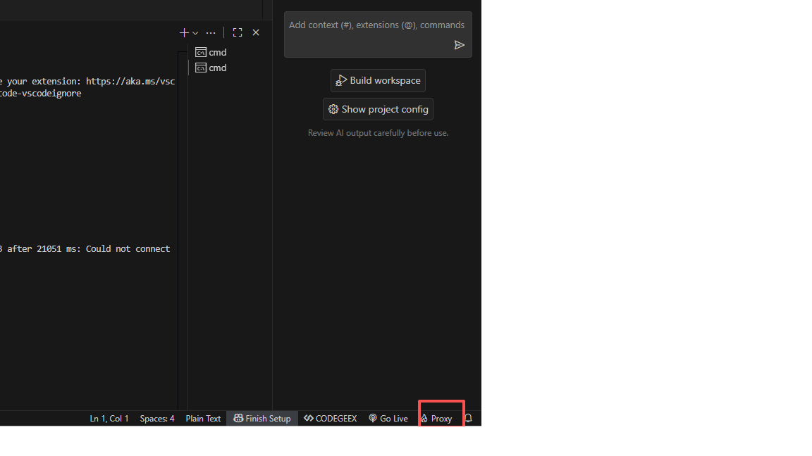

# proxy README

开启本地文件预览/代理服务器

## Features

支持 proxy 代理转发，兼容 `webpack devServer` 配置
支持访问静态文件
动态智能端口，不需要指定 port，插件会自动分配

## Requirements

代理转发 proxy，需要在项目根目录增加 `.proxyrc.js` 配置文件，写入需要的配置信息。（非必选）
如果首次启动会有提示是否自动添加，如果添加了，可直接修改文件内容添加反向代理逻辑。

例如：

```javascript
module.exports = {
  proxy: {
    "/gateway/": {
      target: "http://www.xxx.com",
      pathRewrite: { "^/gateway/": "" },
      changeOrigin: true
    },
    "/api": {
      target: "http://api.xxx.com",
      changeOrigin: true
    }
  }
};
```
安装包proxy-0.1.4.vsix，直接在vs插件本地安装即可。
打开和关闭代理，点击右下角Proxy按钮即可。或者使用ctrl+shift+p，输入proxy，选择proxy server start/stop即可。
